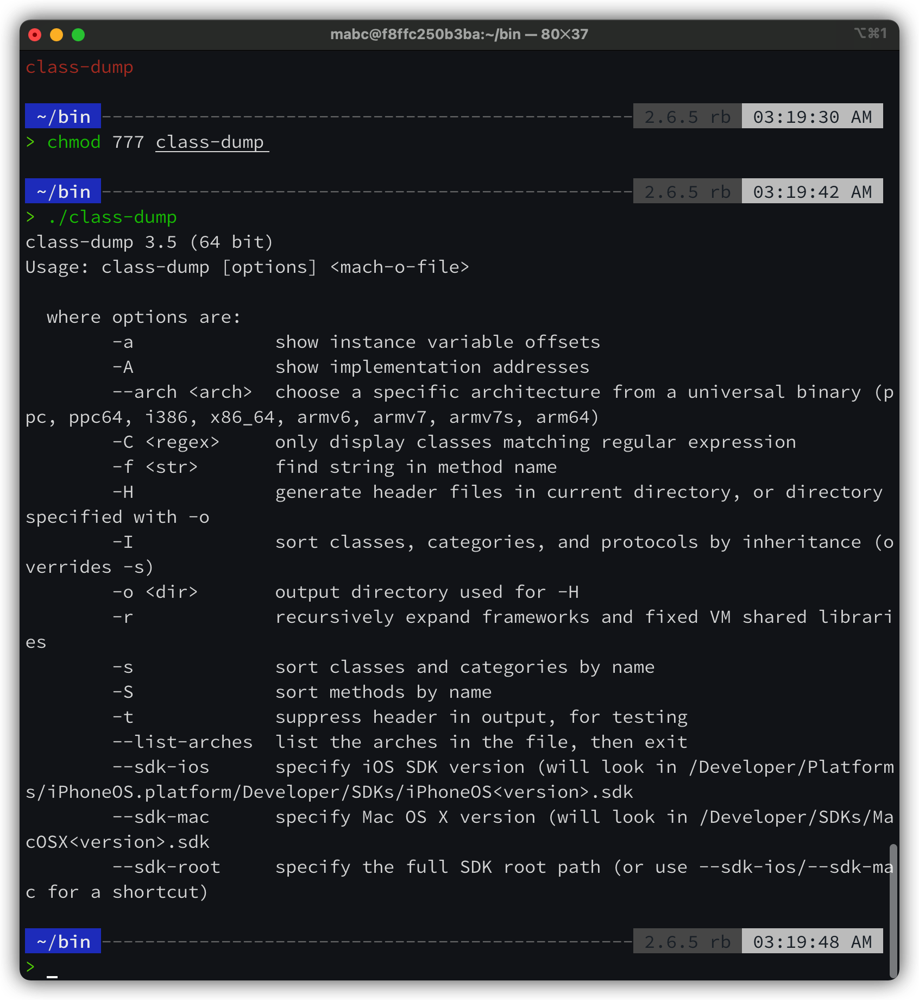

下载 class-dump 

下载网址: http://stevenygard.com/projects/class-dump/


遇到问题 -> 无法复制到 /usr/bin 解决方案

https://juejin.cn/post/6844903622740803598

```
iOS逆向第一步：class-dump无法拷贝入/usr/bin内问题解决方案
iOS逆向第一步：class-dump无法拷贝入/usr/bin内问题解决方案
两种解决方案
1. 在需要往/usr/文件夹内拷贝文件前，先关闭系统的SIP。
以下是具体操作步骤：
复制代码
关闭SIP方法，重启电脑时按住command + R等待开机后，左上方打开终端， 输入$ csrutil disable，回车后重启电脑。这时候就有了权限在/usr/bin操作。
操作完成以后同第一步，终端输入 $ csrutil enable, 重启使SIP生效即可。
2. 在mac当前用户内创建一个~/bin文件夹来存放class-dump
以下是具体操作步骤
复制代码
打开终端，输入$ mkdir ~/bin，在当前用户根目录下创建一个bin目录；

把class-dump给拷贝到这个目录里，并赋予其可执行权限;

把下载好的class-dump文件拖拽进新建的bin文件夹内， 文件夹路径为：~/bin; （当然你也可以用终端命令移动文件过去$ mv /.../class-dump ~/bin (!!!! /.../class-dump是指的class-dump的完整路径)）

$ vi ~/.bash_profile 打开~/.bash_profile 文件，配置环境变量 按 i 键进入编辑模式，写入下面一行代码, $ export PATH=$HOME/bin/:$PATH 按ESC然后输入冒号(shift+;),然后输入wq回车, 退出即可。

第四步，在终端中执行$ source ~/.bash_profile命令

完成以上步骤，在terminal中执行class-dump实验一下，应该就可以了

如果对SIP关闭心生芥蒂的话， 建议第二种方法。
```

亲测第二种方法比较安全方便

修改文件的执行权限 `sudo chmod 777 /usr/bin/class-dump`

运行 `./class-dump` -> 得到下图使用说明

